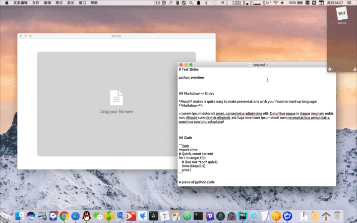

# morph
Use Markdown to create slides.



## Dev prepare
```bash
npm install
bower install
```

## Dev start script
```bash
npm run ng.watch
# after the first command succeeded:
npm run electron.watch
```

## Features

- Easy to use
- Page transition animation
- Auto hide cursor when it stops moving for about 2 seconds
- Pause mode (black screen)
- XSS protection

## Drawbacks

- App package is a little bit large
- Lack of user style support

## References

- [PageTransitions](https://github.com/codrops/PageTransitions)
- [Buttons](https://github.com/alexwolfe/Buttons/)